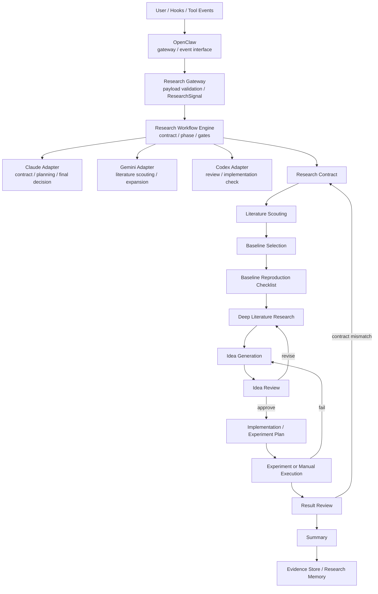

# 科研助手架构批判分析

来源：`科研方法论.md`、手绘草图、OpenClaw CLI / gateway / plugin SDK 现有实现、OpenClaw-first 技术路线讨论。

## 一句话结论

为了尽快做出 demo，技术路线应改为 `OpenClaw-first`：OpenClaw 负责入口和接口层，你自己的 Research Workflow Engine 负责科研状态机，不引入额外 team runtime。
最该补的仍然不是更多 agent，而是三件事：`contract`、`state`、`evidence`。

## 哪些部分是合理的

1. `Planner -> JSON` 是对的。
   科研流程天然需要结构化，否则后面很容易被自然语言拖散。

2. `Critic` 独立出来是对的。
   但它应该是 workflow 里的评审节点，而不是必须依赖独立 team runtime 的 critic agent。

3. `Router` 这个想法是对的，但要拆成两类。
   OpenClaw router 负责 hook event -> gateway；Research router 负责 research phase -> workflow / model adapter。

4. `Summarize -> Memory` 是必要的。
   但记忆必须分层，不能把所有过程日志都当长期记忆。

## 主要问题

1. 缺少第一等公民的 `research contract`。
   没有它，系统很容易在看到实验结果后再补故事。
   方法论里最硬的要求就是：先写假设、成功标准、失败信号、指标、数据划分、claim 到证据的映射。

2. 缺少 `baseline / reproduction` 的硬门槛。
   这一步不是可选项，而是后续所有比较的锚点。
   没有复现 baseline，后面很难判断 idea 到底有没有真实提升。

3. 你现在把科研流程想得太像 DAG。
   科研不是一次性定死的流程图，而是带回边的状态机：
   调研 -> 发散 -> 评审 -> 实现 -> 实验 -> 失败后回退。

4. `Memory` 太像一个大口袋。
   应该拆成：
   - raw log
   - project memory
   - long-term distilled memory

5. `Critic` 还不够细。
   科研里的 critique 不能只是一种评分，而要分成：
   novelty、可行性、复现性、实验设计、证据一致性。

6. 旧方案里 OpenClaw、额外 team runtime、Research Workflow Engine 有调度职责重叠。
   OpenClaw 有 gateway / agent runtime 方向，额外 team runtime 有 task router，你自己又有科研状态机。
   三套调度中心叠在一起，会让状态同步、部署稳定性和责任归属都变复杂。

7. MVP 阶段不该先接额外 team runtime。
   当前最重要的是跑出 demo，而不是先搭一个完整多 agent team runtime。
   如果科研任务暂时不需要多个隔离 worktree 并行，额外 runtime 会带来额外状态、tmux、CLI、版本和部署风险。

## 更合适的分工

- OpenClaw：入口和接口层，负责 hook event、gateway payload、session envelope、外部触发和 agent 调用接口。
- Research Workflow Engine：科研主流程，负责 contract、phase state、baseline gate、evidence gate、review gate。
- Workflows：具体科研动作，包括 literature、baseline、experiment、review、writing。
- Model Adapters：Claude、Gemini、Codex 的直接适配层。
- Evidence Store：raw log、artifact、code summary、research memory、实验结果。

## 为什么 MVP 先不接额外 team runtime

额外 team runtime 不是当前 demo 的前置条件。它通常会带来 task router、worker、summary、memory、agent prompt 等运行时能力。

但对当前 demo 来说，问题不是“运行时能不能做”，而是“现在接它会不会让架构变重”。

旧方案里会同时出现三套状态：

- OpenClaw 的 session / hook event / gateway signal
- Research Workflow Engine 的 phase / contract / evidence state
- 额外 runtime 的 task / worker / inbox / outbox / summary

这会带来几个直接风险：

- single source of truth 不清楚
- 服务器部署依赖变重，容易卡在 tmux、CLI、worker 生命周期
- debug 时不知道问题在 OpenClaw、workflow engine 还是额外 runtime
- demo 目标会被运行时集成复杂度拖慢

所以当前路线应当改成：

```text
MVP 不接额外 team runtime。
OpenClaw 负责入口和接口。
Research Workflow Engine 负责科研状态。
Claude / Gemini / Codex 通过 model adapters 直接调用。
```

## OpenClaw-first 架构

OpenClaw-first 不是把科研流程硬写进 OpenClaw 源码。
更合适的理解是：

> OpenClaw 是 Research Workflow Engine 的入口层和接口层。

推荐链路：

```text
OpenClaw hook event
  -> OpenClaw gateway payload
  -> Research Gateway
  -> Research Workflow Engine
  -> Workflow
  -> Model Adapter
  -> Artifact / Evidence Store
```

各层职责：

- `OpenClaw`：接收 hook event，生成 payload，把事件送到 gateway。
- `Research Gateway`：校验 payload，转换成 ResearchSignal。
- `Research Workflow Engine`：维护 research contract、phase state、gate、回退逻辑。
- `Workflows`：执行 literature、baseline、experiment、review、writing。
- `Model Adapters`：直接调用 Claude、Gemini、Codex。
- `Evidence Store`：保存 raw log、artifact、实验结果、code summary、research memory。

这里的 single source of truth 应该是：

```text
Research Workflow Engine 的 state
```

OpenClaw session 只是触发上下文，不是科研状态源。
模型输出只是 artifact，不是最终事实。

## 后续扩展怎么处理

额外执行层可以先降级成两种角色：

1. 设计参考。
   planner、critic、verifier、summary、memory、team task 思路可以借鉴。

2. 后续可选执行层。
   如果后面真的需要多个 worker 并行、隔离 worktree、后台任务管理，可以再单独设计。

什么时候再考虑扩展执行层：

- 需要多个 Claude / Codex / Gemini worker 并行做任务
- 需要隔离 worktree 跑实现和复现
- 需要长期后台任务管理
- OpenClaw 自带接口和自己的 workflow engine 不够用

在这些条件出现前，直接 OpenClaw-first 更稳。

## demo 阶段的最小闭环

第一版 demo 不要追求完整科研操作系统，只跑通一个小闭环：

```text
用户输入研究方向
  -> 生成 research contract
  -> literature scouting
  -> baseline selection
  -> baseline reproduction checklist
  -> idea generation
  -> idea review
  -> summary + evidence memory
```

第一版可以先不做：

- 多 worker 并行
- 自动代码实现
- 长时间后台实验
- 额外 team runtime
- 复杂 agent 投票

demo 最重要的是让团队看到：

- OpenClaw 能触发 workflow
- workflow 有清晰 phase
- contract 能约束模型
- artifact 能沉淀为 evidence
- 人类能在关键节点 revise / approve

## 为什么 research contract 要可机器校验

`research contract` 当然要给人看，但它不应该只给人看。
它最好是“人类可读内容 + 机器可检查 schema”。

原因很简单：

- 能强制字段齐全，比如 `hypothesis`、`success_criteria`、`failure_signals`、`metrics`
- 能约束类型，比如数组、对象、枚举、布尔值
- 能做版本控制，比如 `v1`、`v2`
- 能在执行前校验，缺字段就拦住
- 能减少“结果出来后再补解释”的空间

Markdown 适合阅读，JSON Schema 适合执行。
如果你要让多个模型和多个运行时共同遵守同一份 contract，schema 迟早要上。

## 推荐的流程骨架（OpenClaw-first）

这里要分清两层：
- `literature scouting`：先做小范围侦察，摸清可用 baseline。
- `deep literature research`：在 baseline 锁定后，再做系统性调研和发散。

所以严格顺序不是“完全没读文献就选 baseline”，而是“先做小范围文献侦察，再选 baseline，再复现，再做深调研”。



角色可以这样理解：

- OpenClaw：入口和接口层。它知道“发生了什么”，但不决定科研上“应该相信什么”。
- Research Gateway：把 OpenClaw payload 变成你的 ResearchSignal。
- Research Workflow Engine：科研助手的大脑。它保存当前阶段、检查 contract、决定推进、回退还是等待人工确认。
- Claude Adapter：主规划、contract 起草、阶段总结、最终裁决。
- Gemini Adapter：文献侦察、搜索扩展、idea 发散。
- Codex Adapter：独立 review、实现检查、复现 checklist、严格判断。

这里的关键不是“每一步都换一个模型”，而是：

- OpenClaw 负责把外部事件变成 gateway payload。
- Research Workflow Engine 是唯一科研状态源。
- Claude / Gemini / Codex 通过 adapters 直接调用。

## 建议优先级

1. 先跑通 `OpenClaw -> Research Gateway -> Workflow Engine`。
2. 先把 `research contract` 定义成 JSON schema。
3. 先做 `literature scouting`，再锁定 `baseline`。
4. 把 `baseline reproduction checklist` 做成 demo 硬门槛。
5. 先拆 `memory / evidence store`，不要一上来就做统一记忆库。
6. 并行 worker、多 agent team runtime 放到 demo 之后。

## 不建议一开始就做的事

- 多模型互相投票。
- 让两个 agent 互相 review 到没完没了。
- 过早接入额外 team runtime。
- 先做一套很重的 DAG 编排，再回头补证据链。
- 把所有上下文都塞进一个 memory。

## 结论

这套思路最好的方向，不是“让 AI 更像一个会聊天的研究小组”，而是“让 AI 在每一步都留下可验证的证据”。
真正决定上限的，不是角色数量，而是上下文隔离、契约约束和证据闭环。
